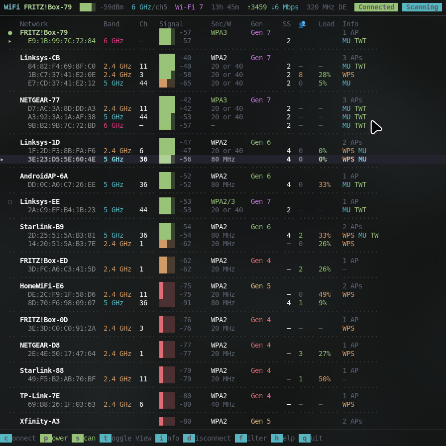
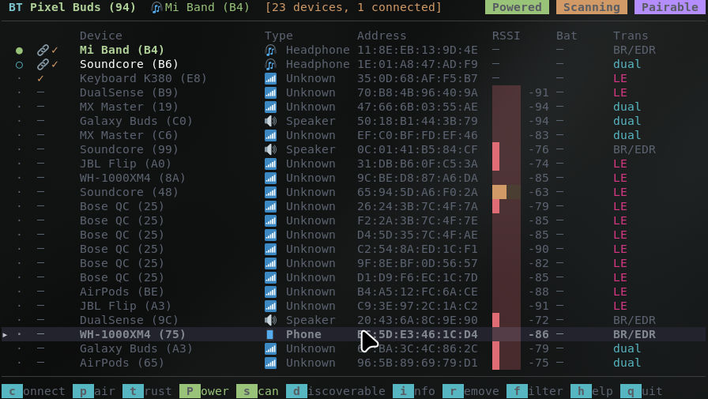

# net-tui

Terminal UI managers for WiFi (`wifi-tui`) and Bluetooth (`bt-tui`) on Linux.

Built with [ratatui](https://ratatui.rs). Shells out to `nmcli` + `iw` for WiFi and `bluetoothctl` for Bluetooth.

| `wifi-tui` | `bt-tui` |
|------------|----------|
|  |  |

## Features

- **Live view** — connection state, signal/RSSI bars and the list refresh on a 250 ms tick.
- **Responsive header** — connection detail sheds fields as the window narrows, and the status badges fold to single letters when there's no room.
- **Wrapping hotkey bar** — the bottom bar flows onto multiple rows so every shortcut stays visible (and clickable) at any width.
- **Mouse support** — scroll to navigate, click a row to select, click the hotkey bar to act.
- **Active-state colors** — toggles like Power / Scan / Discoverable light up green when on.
- `wifi-tui`: grouped or flat view, sort by signal/name, continuous scan toggle (`s`), connect/disconnect, power, password entry, per-link connection-info overlay.
- `bt-tui`: connect / pair / trust / remove, power, scan, discoverable, status-flags column (paired 🔗, trusted ✓, blocked B), per-device detail overlay.

## Install (Nix flake)

```sh
nix run github:yofsh/net-tui#wifi-tui
nix run github:yofsh/net-tui#bt-tui
```

Or add as an input:

```nix
{
  inputs.net-tui.url = "github:yofsh/net-tui";

  # then in your packages:
  environment.systemPackages = [
    inputs.net-tui.packages.${pkgs.system}.wifi-tui
    inputs.net-tui.packages.${pkgs.system}.bt-tui
  ];
}
```

The flake wraps each binary with the required runtime tools on PATH (`networkmanager`, `iw`, `bluez`), so the binaries work out of the box on any NixOS host.

## Build from source

```sh
cargo build --release --workspace
./target/release/wifi-tui
./target/release/bt-tui
```

Runtime requirements: `nmcli` and `iw` for `wifi-tui`, `bluetoothctl` for `bt-tui`.

## Layout

```
crates/
├── core/       # net-tui-core: shared scaffolding (theme, overlay, hotbar, status, runtime, filter)
├── wifi-tui/   # nmcli/iw frontend
└── bt-tui/     # bluetoothctl frontend
```

## Keys

Common: `↑↓/jk` navigate · `g/G` first/last · `/` or `f` filter · `h` help · `q` quit · click the hotbar to act with the mouse.

| | wifi-tui | bt-tui |
|---|----------|--------|
| `c` / `⏎` | connect | connect / disconnect |
| `s` | toggle scan | toggle scan |
| `d` | disconnect | toggle discoverable |
| `i` | connection info | device info |
| `t` / `v` | sort / view | trust |
| `p` / `P` | power | pair / power |
| `r` | — | remove |

`wifi-tui --help` / `bt-tui --help` list all flags and keys; press `h` in-app for the full overlay.
